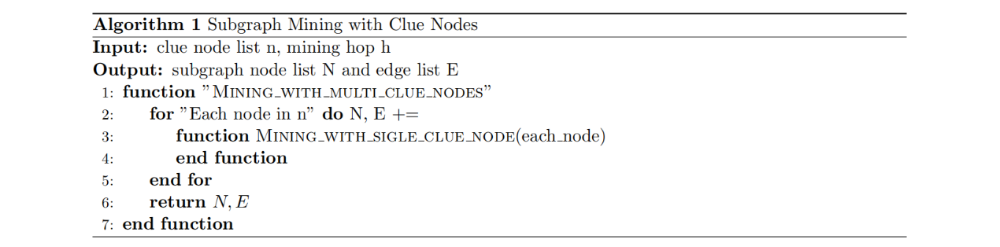

# Black Market.github.io

## 0. Website Demo

Please check the [website](https://wangyimosquito.github.io/BlackMarket.github.io/) if you are interested in our work!

## 1. Problem Description

**background**

This project is an entry for the ChinaVis 2022 Internet black market group identification track. And the detailed documentation offered by the host could be found under `Problem_description` file.

**Dataset**

The original dataset is offered by ChinaVis. There are about 400,000 nodes in the dataset, and each node represent an entity on the Internet. The nodes contains the name, type and possible illegal industry they involved. A directed path dataset is also given for strong, medium, and weak connection between entities.

**Problem definition**

1. Given 5 clues, which are entity nodes, dug out the whole black market group they rely. And the group sizes are also given.
2. Dug out another 5 black market group with designed algorithm.

## 2. Algorithm Design

1. Group identification with clue

   

   

2. Group identification without clue

   
